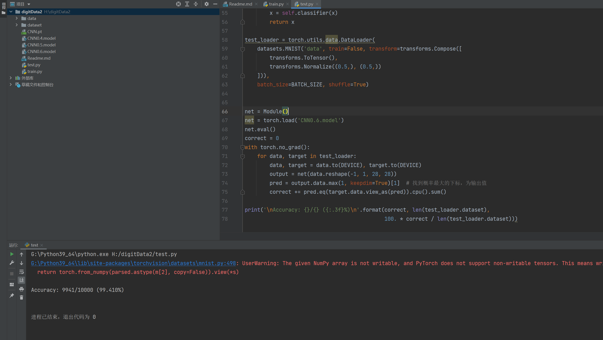

# 基于MNIST数据集的手写体识别(二)

#### 一、算法选择

​	本次作业要求使用CNN进行进行手写体数字的识别，我们直接使用pytorch框架搭建我们的模型

训练环境：Python 3.9， CPU。

**模型：**

这里搭建的神经网络模型比较简单，主要分为学习层和最后的分类层

学习层：由四个卷积层组成，激活函数选择Relu

分类层：由四个线性层组成，激活函数选择Relu

上述模型就是我本次探索的全部结果，由于上一次SVM的经验我并没有使用随机增强的方式对数字体进行增强。这里没有什么很多需要调整的参数：

- 主要是在网络中最后几层分类的时候选择Dropout掩码比例的大小，过大过着过小都不合适，于是主要从0.4，0.5，0.6这三个值当中进行训练对比；
- 对于学习率的选择没有使用手动调参，由于模型较小这里我们直接采用torch当中自带的lr_scheduler来进行调整，我们初始值设定为0.001，他会根据epoch每次衰减lr，最后使用最佳的学习率

#### 二、训练历程

​	由于本次训练同上次不同，我们直接调整超参数即可，我们将超参数信息列在下方：这里主要调整的是drop参数和lr

```python
BATCH_SIZE = 64
EPOCHS = 6 
DEVICE = torch.device("cuda" if torch.cuda.is_available() else "cpu")
learning_rate = 0.001  # 设定初始的学习率
drop = 0.5
```

1.  CNN0.4，dropout=0.4

   - 训练时间：790.6s
   - 训练集：60000张图片
   - 测试集：10000张图片
   - **准确率：99.37%**
2. CNN0.5，dropout=0.5

   - 训练时间：785.6s
   - 训练集：60000张图片
   - 测试集：10000张图片
   - **准确率：99.36%**
3. **CNN0.6，dropout=0.6（这里当drop为0.6的时候我们的训练结果最好为99.41%）**
   - 训练时间：771.3s
   - 训练集：60000张图片
   - 测试集：10000张图片
   - **准确率：99.41%**

可见当drop调整为0.6的时候整体测试效果最佳

#### 三、调用测试

​	由于NN的训练需要划分batch，所以我们直接调用pytorch当中的DataLoader可以直接将我们的测试集读入

```python
test_loader = torch.utils.data.DataLoader(
    datasets.MNIST('data', train=False, transform=transforms.Compose([
        transforms.ToTensor(),
        transforms.Normalize((0.5,), (0.5,))
    ])),
    batch_size=BATCH_SIZE, shuffle=True)
```

​	由于是神经网络模型我们在加载之前需要先进行实例化（第一行），然后就可以调用上述加载的测试数据集

```python
net = Module()
net = torch.load('CNN0.6.model')
net.eval()  # 设置模型进入预测模式 evaluation
correct = 0
with torch.no_grad():  
    for data, target in test_loader:
        data, target = data.to(DEVICE), target.to(DEVICE)
        output = net(data.reshape(-1, 1, 28, 28))
        pred = output.data.max(1, keepdim=True)[1]  # 找到概率最大的下标，为输出值
        correct += pred.eq(target.data.view_as(pred)).cpu().sum() 

print('\nAccuracy: {}/{} ({:.3f}%)\n'.format(correct, len(test_loader.dataset),
                                             100. * correct / len(test_loader.dataset)))
```

这里调用CNN0.6显示的结果：

​	
